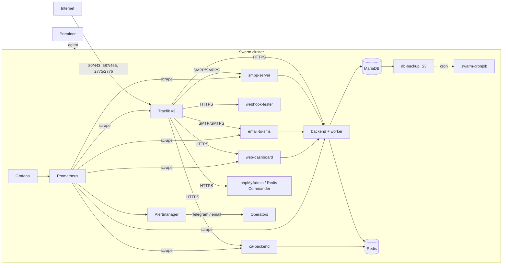

# android-sms-gateway Infrastructure

Docker Swarm deployment stack for the [android-sms-gateway](https://github.com/android-sms-gateway) SMS gateway platform. This repository contains the compose stacks, service configuration, and monitoring setup that run the production gateway: reverse proxy, database, cache, application services, alerting, and dashboards.

## Table of Contents

- [android-sms-gateway Infrastructure](#android-sms-gateway-infrastructure)
  - [Table of Contents](#table-of-contents)
  - [About The Project](#about-the-project)
  - [Architecture](#architecture)
    - [Stacks](#stacks)
  - [Features](#features)
  - [Getting Started](#getting-started)
    - [Prerequisites](#prerequisites)
    - [Cluster preparation](#cluster-preparation)
  - [Installation](#installation)
    - [1. Infrastructure stack](#1-infrastructure-stack)
    - [2. Application stack](#2-application-stack)
    - [3. Monitoring stack](#3-monitoring-stack)
    - [4. Portainer (optional)](#4-portainer-optional)
    - [Updating configuration](#updating-configuration)
  - [Configuration](#configuration)
    - [Common](#common)
    - [Infrastructure - database backup](#infrastructure---database-backup)
    - [Infrastructure - Traefik](#infrastructure---traefik)
    - [Monitoring](#monitoring)
    - [Application - HTTP / proxy](#application---http--proxy)
    - [Application - backend database](#application---backend-database)
    - [Application - FCM (Firebase Cloud Messaging)](#application---fcm-firebase-cloud-messaging)
    - [Application - certificate authority](#application---certificate-authority)
    - [Application - service URLs](#application---service-urls)
    - [Secrets](#secrets)
  - [Usage](#usage)
    - [Exposed services](#exposed-services)
    - [Operations notes](#operations-notes)
  - [Contributing](#contributing)
  - [License](#license)
  - [Contact](#contact)
  - [Acknowledgments](#acknowledgments)


## About The Project

The platform delivers SMS messages through mobile devices and third-party channels. This repository packages all server-side infrastructure for a single- or multi-node deployment:

- **Problem**: The gateway needs a production-grade runtime: TLS termination, persistent storage, scheduled backups, monitoring, and alerting.
- **Solution**: Four self-contained Docker Swarm stacks, declarative service configuration, and secrets management through Swarm secrets.
- **Intended users**: Operators and developers who deploy or maintain the gateway infrastructure.

Everything here is configuration-as-code: no application source code lives in this repository, only the stacks that run it.

## Architecture



### Stacks

| File                     | Stack name   | Contents                                                                                                                                                   |
| ------------------------ | ------------ | ---------------------------------------------------------------------------------------------------------------------------------------------------------- |
| `compose.infra.yml`      | `infra`      | Traefik v3 reverse proxy, MariaDB, Redis, phpMyAdmin, Redis Commander, S3 backup job, swarm-cronjob. Creates the `internal` and `public` overlay networks. |
| `compose.app.yml`        | `app`        | Backend API + worker, ca-backend, smpp-server, email-to-sms, webhook-tester, web-dashboard.                                                                |
| `compose.monitoring.yml` | `monitoring` | Prometheus, Alertmanager, cAdvisor, Grafana.                                                                                                               |
| `compose.portainer.yml`  | `portainer`  | Portainer CE and its agent (optional management UI).                                                                                                       |

The `infra` stack must be deployed first: the `app` and `monitoring` stacks consume the `internal` and `public` networks and Swarm secrets it requires.

## Features

- **TLS by default**: Traefik terminates HTTPS with Let's Encrypt certificates; the `cloudflare` cert resolver uses DNS-01 challenges for SMPPS, SMTPS, and public HTTPS routes.
- **HTTP, SMTP, and SMPP gateways**: traffic routing on ports 80/443 (HTTPS), 587/465 (SMTP/SMTPS), and 2775/2776 (SMPP/SMPPS).
- **Mobile push**: backend sends Firebase Cloud Messaging (FCM) notifications from a Google service-account credential.
- **Rate limiting and access control**: per-route rate limits for the API and webhook endpoints; basic auth and IP allowlists for dashboards and metrics.
- **Scheduled database backups**: MariaDB dumps uploaded to S3 on a cron schedule via swarm-cronjob.
- **Certificate authority**: `ca-backend` issues short-lived device certificates signed by a root CA stored in Swarm secrets.
- **Monitoring and alerting**: Prometheus scrapes services labeled `prometheus.io/scrape=true`; Alertmanager routes `critical` alerts to Telegram and `warning`/`info` to email; Grafana for visualization.
- **Container metrics**: cAdvisor runs globally on every node.
- **Multi-node placement**: services pin to labeled nodes (`redis`, `db`, `traefik`, `cronjob`, `prometheus`, `grafana`, `portainer`).
- **Dashboard access**: phpMyAdmin, Redis Commander, and the Traefik dashboard behind basic auth; Prometheus and Alertmanager behind IP allowlists; Grafana with login.
- **CI hygiene**: GitHub Actions close stale issues/PRs and strip `ready`/`deployed` labels on new pushes.

## Getting Started

### Prerequisites

- Docker Engine with Swarm mode enabled (one or more Linux nodes; the `portainer` agent is global on Linux nodes only).
- A public domain with DNS records pointing at the cluster (see [Usage](#usage) for the hostnames to expose).
- A Cloudflare API token with DNS edit permission (used for ACME DNS-01 challenges).
- Access to a terminal on a Swarm manager node.

### Cluster preparation

1. Initialize or join the Swarm (run on the first manager):

   ```sh
   docker swarm init
   ```

2. Label nodes for service placement. Each service pins to a node label; labels that do not exist simply stay empty until their services are deployed:

   ```sh
   docker node update --label-add redis=true <manager-node>
   docker node update --label-add db=true <db-node>
   docker node update --label-add traefik=true <manager-node>
   docker node update --label-add cronjob=true <manager-node>
   docker node update --label-add prometheus=true <monitoring-node>
   docker node update --label-add grafana=true <monitoring-node>
   docker node update --label-add portainer=true <manager-node>
   ```

3. Create the external secrets referenced by the stacks (values are operator-provided):

   ```sh
   docker secret create mariadb_root_password -
   docker secret create users.htpasswd -
   docker secret create root-ca.crt -
   docker secret create root-ca.key -
   docker secret create telegram_bot_token -
   docker secret create email_password -
   docker secret create grafana_admin_password -
   ```

   All secrets are declared `external: true` in the compose files, so they must exist before stack deployment.

4. Create the environment file from the template and fill in your values:

   ```sh
   cp .env.example .env
   ```

   See [Configuration](#configuration) for every variable. `.env` is gitignored.

   `docker stack deploy` interpolates variables from the shell environment, not automatically from `.env`. Load it into the shell before each deployment (for example, `set -a; source .env; set +a`). Required variables such as `ROOT_DOMAIN` must be set or deployment will fail or substitute empty values.

## Installation

Deploy the stacks in order: `infra` first (it creates the `internal` and `public` overlay networks), then `app`, `monitoring`, and optionally `portainer`.

### 1. Infrastructure stack

```sh
docker stack deploy -c compose.infra.yml infra
```

This creates the `internal` and `public` overlay networks, the `redis-data`, `mariadb-data`, and `letsencrypt` volumes, and starts Traefik, MariaDB, Redis, Redis Commander, phpMyAdmin, and the cron scheduler.

### 2. Application stack

```sh
docker stack deploy -c compose.app.yml app
```

Deploys the backend API, worker, CA backend, SMPP server, email-to-SMS gateway, webhook tester, and web dashboard. The `worker` service starts with zero replicas; scale it if background tasks are needed.

### 3. Monitoring stack

```sh
docker stack deploy -c compose.monitoring.yml monitoring
```

Deploys Prometheus, Alertmanager, cAdvisor (global), and Grafana.

### 4. Portainer (optional)

```sh
docker stack deploy -c compose.portainer.yml portainer
```

Deploys Portainer CE (published through the Swarm routing mesh on port 9443; the service task runs on a manager node) and a global agent on all Linux nodes.

### Updating configuration

Compose `configs` are versioned with `STACK_VERSION`. After editing a config file, bump `STACK_VERSION` in `.env` and re-deploy the stack that uses it to push the updated config:

- Traefik (`traefik.yml`, `dynamic.yml`) and MariaDB configs → `docker stack deploy -c compose.infra.yml infra`
- Backend `backend/config.yml` → `docker stack deploy -c compose.app.yml app`
- Prometheus and Alertmanager configs → `docker stack deploy -c compose.monitoring.yml monitoring`

## Configuration

All configuration lives in `.env` (copy of `.env.example`) plus Swarm secrets. Variable names use `__` as a section separator (for example, `DB_BACKUP__SCHEDULE`).

### Common

| Variable        | Purpose                                                                             | Default | Required |
| --------------- | ----------------------------------------------------------------------------------- | ------- | -------- |
| `TIMEZONE`      | Container timezone (TZ) for all services; also used as backend `DATABASE__TIMEZONE` | `UTC`   | no       |
| `ROOT_DOMAIN`   | Base domain for all public hostnames routed by Traefik                              | -       | yes      |
| `STACK_VERSION` | Version suffix for Swarm config names; bump to force config re-deployment           | `0`     | no       |

### Infrastructure - database backup

| Variable                           | Purpose                                                               | Default      | Required |
| ---------------------------------- | --------------------------------------------------------------------- | ------------ | -------- |
| `DB_BACKUP__AWS_REGION`            | AWS region of the backup S3 bucket                                    | `us-east-1`  | no       |
| `DB_BACKUP__AWS_ACCESS_KEY_ID`     | IAM access key with write access to the backup bucket                 | -            | yes      |
| `DB_BACKUP__AWS_SECRET_ACCESS_KEY` | IAM secret key paired with the access key ID                          | -            | yes      |
| `DB_BACKUP__PASSWORD`              | Password of the MariaDB `backup` user                                 | -            | yes      |
| `DB_BACKUP__OPTIONS`               | Extra mysqldump options for the backup job                            | `--skip-ssl` | no       |
| `DB_BACKUP__STORAGE_URL`           | S3 destination of the dump (`s3://bucket/prefix`)                     | -            | yes      |
| `DB_BACKUP__SCHEDULE`              | Cron expression that triggers the backup job (single quotes required) | `'@daily'`   | no       |

### Infrastructure - Traefik

| Variable                        | Purpose                                                                                | Default                    | Required |
| ------------------------------- | -------------------------------------------------------------------------------------- | -------------------------- | -------- |
| `DB_ADMIN_AUTH`                 | htpasswd pair protecting phpMyAdmin (`pma.<domain>`); bcrypt hash, `$` escaped as `$$` | -                          | yes      |
| `DASHBOARD_AUTH`                | htpasswd pair protecting the Traefik dashboard (`admin.<domain>`)                      | -                          | yes      |
| `TRAEFIK__METRICS_IP_WHITELIST` | IP/CIDR ranges allowed to reach the Traefik metrics middleware                         | `127.0.0.1,192.168.0.0/16` | no       |
| `TRAEFIK__CF_DNS_API_TOKEN`     | Cloudflare API token (DNS edit) for the ACME DNS-01 cert resolver                      | -                          | yes      |

### Monitoring

| Variable                     | Purpose                                            | Default                    | Required |
| ---------------------------- | -------------------------------------------------- | -------------------------- | -------- |
| `PROMETHEUS__IP_ALLOWLIST`   | IP/CIDR ranges allowed to open the Prometheus UI   | `127.0.0.1,192.168.0.0/16` | no       |
| `ALERTMANAGER__IP_ALLOWLIST` | IP/CIDR ranges allowed to open the Alertmanager UI | `127.0.0.1,192.168.0.0/16` | no       |

### Application - HTTP / proxy

| Variable             | Purpose                                                      | Default           | Required |
| -------------------- | ------------------------------------------------------------ | ----------------- | -------- |
| `HTTP__PROXY_HEADER` | Header carrying the real client IP, read by backend, ca-backend, email-to-sms, and web-dashboard | `X-Forwarded-For` | no       |
| `HTTP__PROXIES`      | Comma-separated trusted proxy IP ranges                      | -                 | yes      |
| `API_SUBDOMAIN`      | Subdomain serving the backend API (`<value>.<ROOT_DOMAIN>`)  | `api`             | no       |

### Application - backend database

| Variable                            | Purpose                                          | Default   | Required |
| ----------------------------------- | ------------------------------------------------ | --------- | -------- |
| `BACKEND__DATABASE__HOST`           | MariaDB hostname reachable by backend and worker | `db`      | no       |
| `BACKEND__DATABASE__USER`           | MariaDB login user for backend and worker        | `backend` | no       |
| `BACKEND__DATABASE__PASSWORD`       | MariaDB password for the user above              | -         | yes      |
| `BACKEND__DATABASE__DATABASE`       | Default database name used by backend and worker | `backend` | no       |
| `BACKEND__DATABASE__MAX_OPEN_CONNS` | Max open database connections (`0` = unlimited)  | `0`       | no       |
| `BACKEND__DATABASE__MAX_IDLE_CONNS` | Max idle database connections (`0` = unlimited)  | `0`       | no       |

### Application - FCM (Firebase Cloud Messaging)

| Variable                | Purpose                                                                          | Default | Required |
| ----------------------- | -------------------------------------------------------------------------------- | ------- | -------- |
| `FCM__CREDENTIALS_JSON` | Google service-account key JSON (single-line string) used for push notifications | -       | yes      |

### Application - certificate authority

| Variable            | Purpose                                                                          | Default               | Required |
| ------------------- | -------------------------------------------------------------------------------- | --------------------- | -------- |
| `CSR__TTL`          | Validity of certificates issued by `ca-backend`                                  | `24h`                 | no       |
| `CSR__CA_CERT_PATH` | Path to the root CA certificate inside `ca-backend` (Swarm secret `root-ca.crt`) | `/run/secrets/ca.crt` | no       |
| `CSR__CA_KEY_PATH`  | Path to the root CA private key inside `ca-backend` (Swarm secret `root-ca.key`) | `/run/secrets/ca.key` | no       |

### Application - service URLs

| Variable                              | Consumed by                                      | Default                               | Required |
| ------------------------------------- | ------------------------------------------------ | ------------------------------------- | -------- |
| `SMPP__GATEWAY__API_BASE_URL`         | `smpp-server` (backend 3rd-party API base URL)   | `http://backend:3000/api/3rdparty/v1` | no       |
| `EMAIL_TO_SMS__GATEWAY__API_BASE_URL` | `email-to-sms` (backend 3rd-party API base URL)  | `http://backend:3000/api/3rdparty/v1` | no       |
| `WEBHOOK__REDIS_DSN`                  | `webhook-tester` Redis connection DSN            | `redis://redis:6379/1`                | no       |
| `WEB_DASHBOARD__GATEWAY__URL`         | `web-dashboard` (backend 3rd-party API base URL) | `http://backend:3000/api/3rdparty/v1` | no       |

### Secrets

Swarm secrets (all declared `external: true`):

| Secret                       | Used by                 | Purpose                                                     |
| ---------------------------- | ----------------------- | ----------------------------------------------------------- |
| `mariadb_root_password`      | `db`                    | MariaDB root password                                       |
| `users.htpasswd`             | Traefik file middleware | Basic auth for Redis Commander and metrics endpoints        |
| `root-ca.crt`, `root-ca.key` | `ca-backend`            | Root CA certificate and key for device certificate issuance |
| `telegram_bot_token`         | Alertmanager            | Telegram bot token for `critical` alerts                    |
| `email_password`             | Alertmanager            | SMTP password for email alerts                              |
| `grafana_admin_password`     | Grafana                 | Admin password (read from file at startup)                  |

## Usage

### Exposed services

All hostnames use `ROOT_DOMAIN` as the suffix and TLS is terminated by Traefik.

| Host                  | Service                                                  | Access control                                   |
| --------------------- | -------------------------------------------------------- | ------------------------------------------------ |
| `api.<domain>`        | Backend API: `/3rdparty`, `/upstream`, `/mobile` paths   | Route-specific rate limits                       |
| `ca.<domain>`         | Certificate issuance API                                 | POST limited to 1 per minute                     |
| `smpp.<domain>`       | SMPP server (TCP 2775/2776) + `/metrics`                 | Metrics behind auth + IP allowlist               |
| `smtp.<domain>`       | Email-to-SMS gateway (SMTP 587 / SMTPS 465) + `/metrics` | Metrics behind auth + IP allowlist               |
| `webhook.<domain>`    | Webhook testing tool (capture + inspect)                 | Rate limited (10 req/s general, 5 req/s capture) |
| `dashboard.<domain>`  | Web dashboard                                            | -                                                |
| `admin.<domain>`      | Traefik dashboard                                        | Basic auth (`DASHBOARD_AUTH`)                    |
| `pma.<domain>`        | phpMyAdmin                                               | Basic auth (`DB_ADMIN_AUTH`)                     |
| `redis.<domain>`      | Redis Commander                                          | Basic auth (`users.htpasswd`)                    |
| `prometheus.<domain>` | Prometheus UI                                            | IP allowlist                                     |
| `alerts.<domain>`     | Alertmanager UI                                          | IP allowlist                                     |
| `mon.<domain>`        | Grafana                                                  | Login (`grafana_admin_password`)                 |
| `https://<node>:9443` | Portainer CE                                             | Login (first-run admin setup)                    |

The Traefik `http` entrypoint (port 80) redirects all traffic to HTTPS.

### Operations notes

- **Backups**: the `db-backup` service runs on the `DB_BACKUP__SCHEDULE` cron and uploads a MariaDB dump to `DB_BACKUP__STORAGE_URL`; it runs as a cron job, so `docker service ps` shows no running tasks between runs.
- **Config updates**: bump `STACK_VERSION` and re-deploy the stack to roll out changed config files (see [Installation](#installation)).
- **Scaling**: the backend `worker` service is deployed with `replicas: 0`; scale it explicitly when background processing is required.
- **Metrics**: services labeled `prometheus.io/scrape=true` publish Prometheus metrics; scrape targets are discovered via those labels on the `internal` network.

## Contributing

This repository follows a standard GitHub flow:

1. Fork the repository and create a feature branch.
2. Keep changes scoped to a single concern (a compose file, a config file, or docs).
3. Open a pull request with a clear description of the change and any verification performed.
4. Add the `ready` label once the PR passes review, and `deployed` once the change is live.

Note the automation in `.github/workflows/`:

- `close-issues-prs.yml` marks issues/PRs stale after 7 days of inactivity and closes them after 7 more days; assigned items are exempt.
- `pr-labels.yml` removes the `ready` and `deployed` labels whenever new commits are pushed to a PR.

## License

Distributed under the Apache License 2.0. See [LICENSE](LICENSE) for details.

## Contact

Project repository: https://github.com/android-sms-gateway/infra

## Acknowledgments

- [Traefik](https://traefik.io/) - reverse proxy and TLS termination
- [Prometheus](https://prometheus.io/) and [Alertmanager](https://prometheus.io/docs/alerting/latest/alertmanager/) - metrics and alert routing
- [Grafana](https://grafana.com/) - dashboards
- [cAdvisor](https://github.com/google/cadvisor) - container metrics
- [MariaDB](https://mariadb.org/) - primary database
- [Redis](https://redis.io/) - cache, pub/sub, and webhook session storage
- [phpMyAdmin](https://www.phpmyadmin.net/) - database administration
- [Portainer](https://www.portainer.io/) - Swarm management UI
- [swarm-cronjob](https://github.com/crazy-max/swarm-cronjob) - scheduled job execution
- [webhook-tester](https://github.com/tarampampam/webhook-tester) - webhook testing
